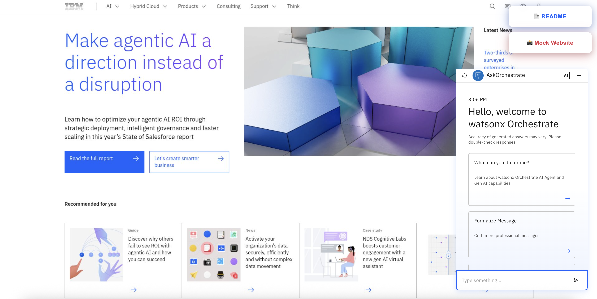
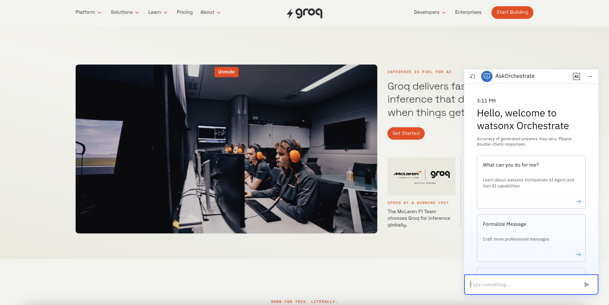
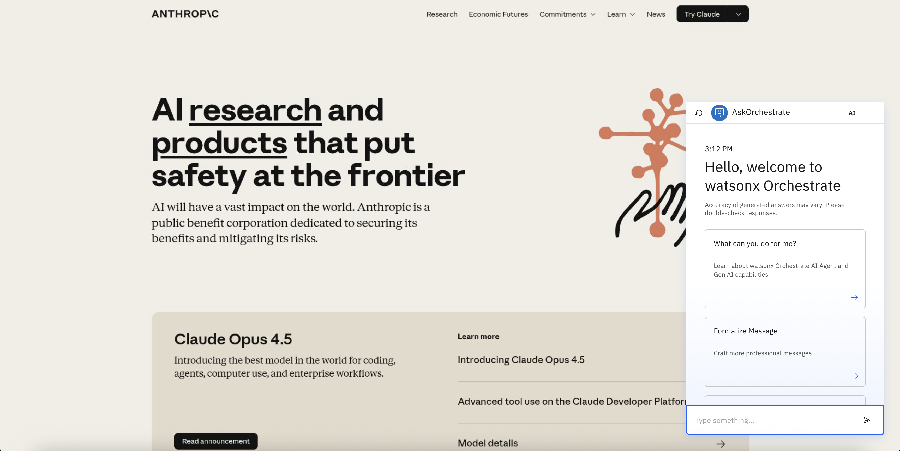
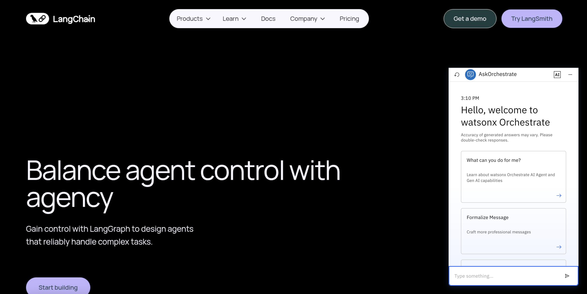
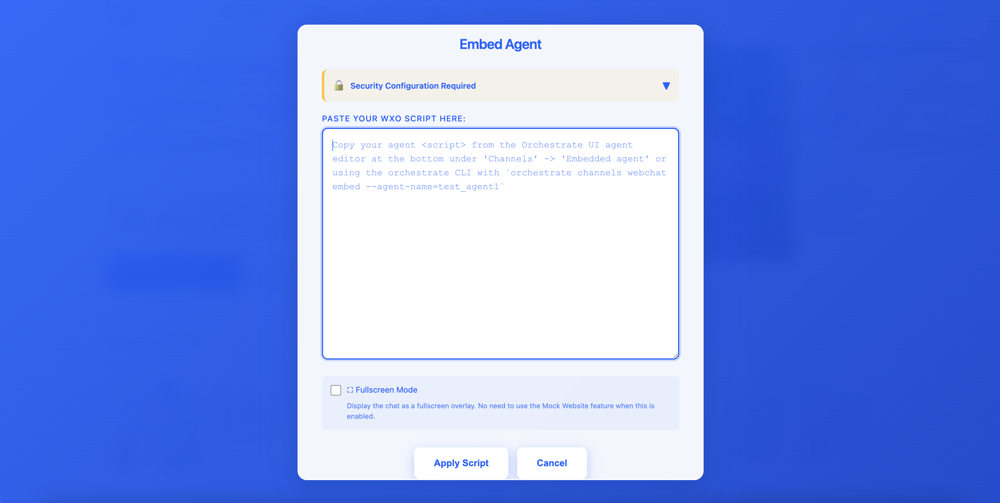
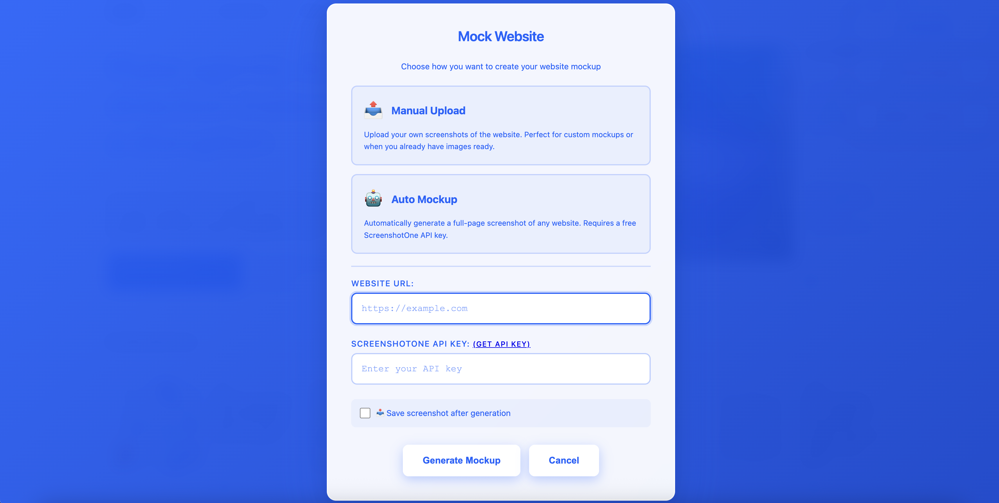
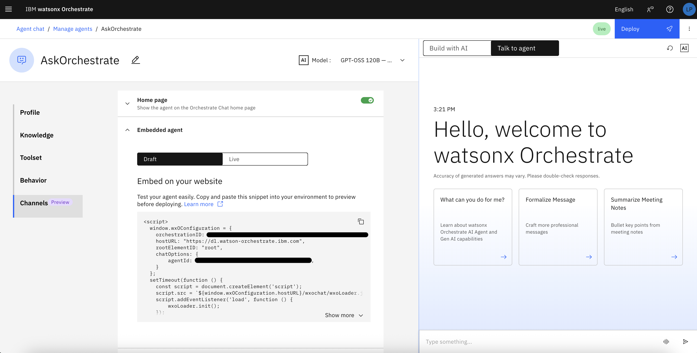

# WxO in Application: Quickstart Mock Website

This project provides a quick and simple way to demo Watsonx Orchestrate agents to clients inside a mockup of their infrastructure, creating a real visual experience.


<a href="https://drive.google.com/file/d/1ta2Aqh1rKmz_lQC4jYwuHRDwQpwNkoqH/view?usp=sharing" target="_blank"> Demo Video </a>

## End Result

An aesthetically exact though functionally simple mocked-up version of your client's website with your WxO agent embedded to demonstrate value in a real-world context.






## Quick Start

1. Run `npm install` to install dependencies
2. Run `npm run dev` to start the application
3. Click the **README** button for detailed instructions
4. Follow the two main steps:
   - **Mock Website**: Create a visual mockup of your client's site
   - **Embed Agent**: Add your WxO agent to the mockup





## Mock Website Options

The application provides two ways to create website mockups:

#### Option 1: Manual Upload
- Take screenshots of your client's website
- Upload multiple images at once
- Images stack vertically to create a full-page mockup
- Best for custom mockups or when you already have screenshots ready

The repository includes sample assets for quick testing:

- **ibm.jpeg**: One placeholder image displayed on initial load
- **ibm_manual/**: Directory containing 5 sample IBM website screenshots (ibm-1.png through ibm-5.png)
  - These can be used to test the manual upload functionality
  - Demonstrates how multiple screenshots stack vertically to create a full-page mockup

#### Option 2: Auto Mockup
- Automatically generate full-page screenshots of any website
- Powered by ScreenshotOne API (100 free screenshots/month)
- Optional auto-download of generated screenshots
- Perfect for quick demos

<br>


## 🤖 Embed Agent

Easily embed your Watsonx Orchestrate agent into the mockup:

### Getting the Embed Script

**Option A - Using SaaS UI:**
1. Navigate to Agent Builder → Channels → Embedded Agent section
2. Copy the HTML script tag



**Option B - Using CLI:**
1. Deploy your agent in watsonx Orchestrate
2. Log into your cloud wxo environment: `orchestrate env activate yourEnv`
3. Run: `orchestrate channels webchat embed --agent-name=AGENT_NAME`
4. Copy the returned HTML script tag


### Applying the Script

1. Click the **Embed Agent** button
2. Paste the entire script tag into the textarea
3. Click **Apply Script**
4. The agent will be loaded for the current session


### 🔒 Security Configuration

**Important:** You must disable security settings for each agent to allow anonymous access in embedded chat.

1. Click the **Embed Agent** button
2. Expand the "Security Configuration Required" section
3. Download the security configuration tool
4. Run the tool:
   ```bash
   chmod +x wxO-embed-chat-security-tool.sh
   ./wxO-embed-chat-security-tool.sh
   ```
5. When prompted, provide:
   - **Service instance URL**: Found in watsonx Orchestrate Settings > API Details tab
   - **API Key**: Also found in the API Details tab
6. Follow the prompts to **DISABLE** security settings and allow anonymous access (or set up more complex security)


## Another option: self-hosting with Docker

This application can be self-hosted using Docker containers and deployed to various platforms including Quay.io and IBM Code Engine. This will allow you to access the tool online without needing to run it locally.

### Building the Docker Image

The application includes a [`Dockerfile`](Dockerfile) that uses nginx:alpine for a lightweight web server configuration.

**Build the image for multiple platforms (ARM and AMD):**

Code Engine requires AMD64 architecture, so we use Docker buildx to build for both ARM and AMD platforms:

```bash
docker buildx build --platform linux/amd64,linux/arm64/v8 -t wxo-in-web:latest .
```

**For local testing only (single platform):**

```bash
docker build -t wxo-in-web:latest .
```

**Run locally:**

```bash
docker run -p 8080:8080 wxo-in-web:latest
```

Access the application at `http://localhost:8080`

### Pushing to Quay.io

[Quay.io](https://quay.io) is a container registry that provides secure storage and distribution of container images.

**1. Create a Quay.io account :**
- Sign up at [quay.io](https://quay.io)

**2. Log in to Quay.io:**

```bash
docker login quay.io
```

**3. Tag your docker image for quay:**

```bash
docker tag wxo-in-web quay.io/<QUAYUSERNAME>/wxo-in-web:latest
```

**4. Push to quay:**
```bash
docker push quay.io/<QUAYUSERNAME>/wxo-in-web:latest
```

**5. Make the quay repo public:**
In your repo settings, make the quay repo public. If you have a paid account, you can make a private repo accessible via the robots feature.

### Deploying to IBM Code Engine

[IBM Code Engine](https://www.ibm.com/cloud/code-engine) is a fully managed, serverless platform for containerized workloads.

1. Log into [IBM Cloud CodeEngine Serverless Projects](https://cloud.ibm.com/containers/serverless/projects) and create a new project
2. Create a new CodeEngine application
    - Set name to something like `wxo-in-web`
    - `Configure` the image
        - `Registry server`: quay.io
        - `namespace`: your quay.io username
        - `repository`: wxo-in-site
        - `tag`: latest
3. Deploy the application
4. Test the application: Press `Test Application` > `Application URL`